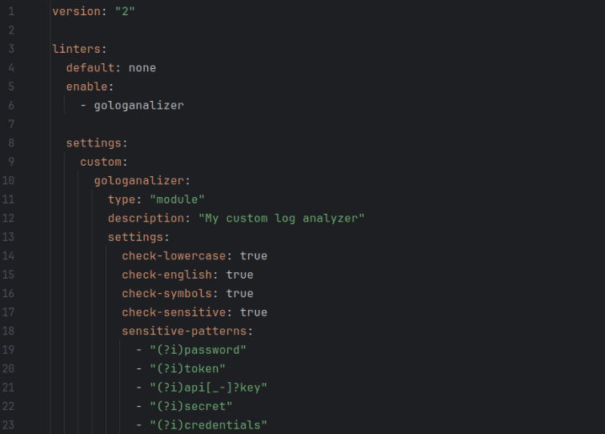
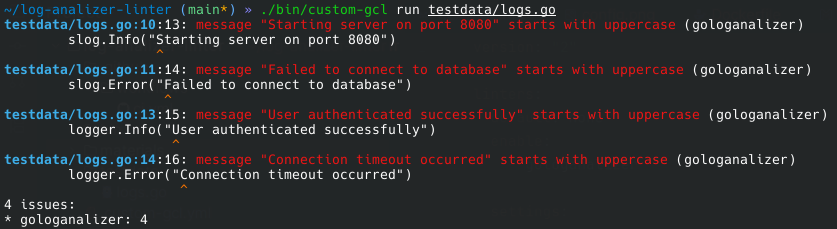
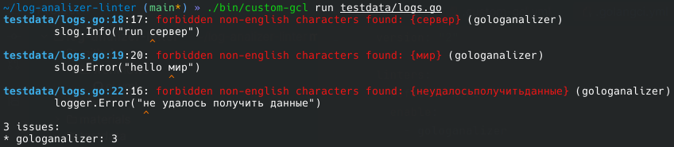
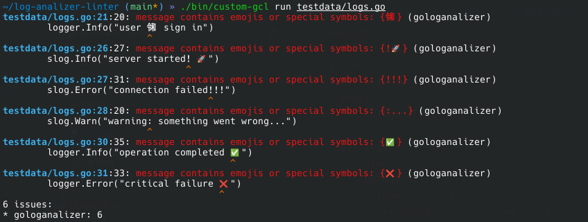
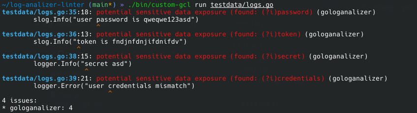
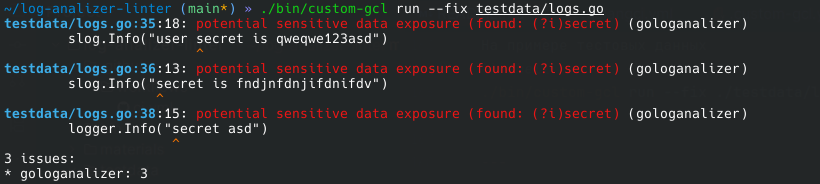
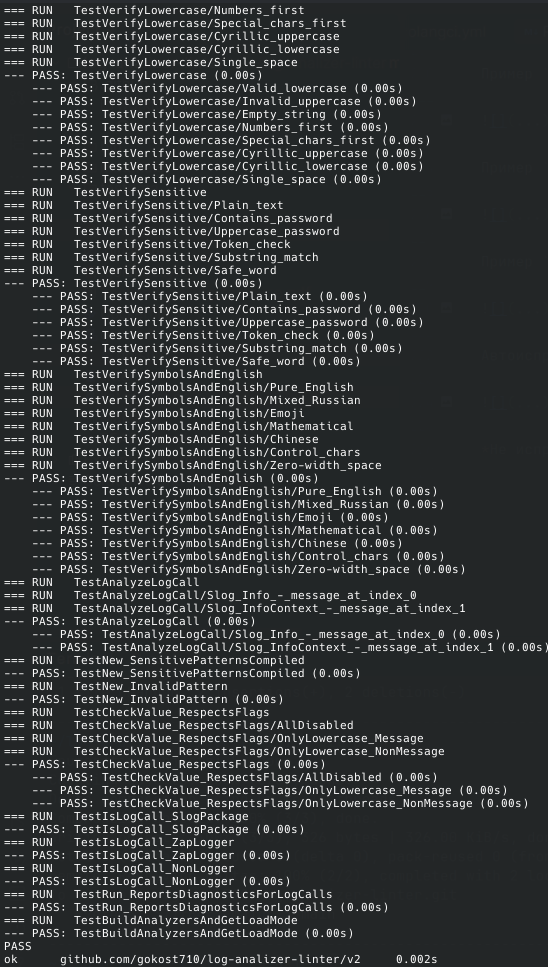

# gologanalizer
Golang линтер для анализа и исправления некорректных логов в проекте. Имеет гибкую настройку и интеграцию с [golangci-lint](https://github.com/golangci/golangci-lint).

## Описание
Линтер анализирует вызовы логгеров и проверяет текст лог-сообщений на соответствие заданным правилам. При использовании флага `--fix` исправляет ошибки.

Поддерживаемые логгеры:
- [log/slog](https://pkg.go.dev/log/slog)
- [go.uber.org/zap](https://github.com/uber-go/zap)


## Применяемые правила
1. **Сообщения должны начинаться со строчной буквы**

   ❌ Неправильно
   ```go
   log.Info("Starting server on port 8080")
   slog.Error("Failed to connect to database")
   ```
   
   ✅ Правильно

   ```go
   log.Info("starting server on port 8080")
   slog.Error("failed to connect to database")
   ```

2. **Сообщения должны быть на английском языке**

   ❌ Неправильно
    ```go
    log.Info("запуск сервера")
    log.Error("ошибка подключения к базе данных")
    ```

   ✅ Правильно

    ```go
    log.Info("starting server")
    log.Error("failed to connect to database")
    ```

3. **Запрещены спецсимволы и эмодзи**

   ❌ Неправильно
    ```go
    log.Info("server started!🚀")
    log.Error("connection failed!!!")
    log.Warn("warning: something went wrong...")
    ```
    
   ✅ Правильно

    ```go
    log.Info("server started")
    log.Error("connection failed")
    log.Warn("something went wrong")
    ```

4. Запрещены потенциально чувствительные данные
   
   ❌ Неправильно
    ```go
    log.Info("user password: " + password)
    log.Debug("api_key=" + apiKey)
    log.Info("token: " + token)
    ```

   ✅ Правильно
    
    ```go
    log.Info("user authenticated successfully")
    log.Debug("api request completed")
    log.Info("token validated")
    ```
## Требования
 - [golang](https://github.com/golang/go) v1.26+
 - [golangci-lint](https://github.com/golangci/golangci-lint) v2+
   
## Установка и подключение

Линтер подключается как модульный плагин golangci-lint.

1. **Создать файл `.custom-gcl.yml`**
   ```yaml
   version: v2.10.1
   name: custom-gcl
   destination: ./bin

   plugins:
     - module: github.com/gokost710/log-analizer-linter/v2
       import: github.com/gokost710/log-analizer-linter/v2
       version: v2.0.2
   ```

2. **Собрать кастомный golangci-lint**
   ```bash
   golangci-lint custom
   ```

   Будет создан бинарник:

   ```bash
   ./bin/custom-gcl
   ```

3. **Включить линтер в `.golangci.yml`**
   ```yaml
   linters:
     enable:
       - gologanalyzer

   linters-settings:
     gologanalyzer:
       check-lowercase: true
       check-english: true
       check-symbols: true
       check-sensitive: true
       sensitive-patterns:
        - "(?i)password"
        - "(?i)token"
        - "(?i)api[_-]?key"
        - "(?i)secret"
        - "(?i)credentials"
   ```
   *Каждое правило и паттерн чувствительных данных требует явного подключения в конфиг файле*

4. **Запуск**
   ```bash
   ./bin/custom-gcl run ./...
   ```
   
   Тестовый файл есть в директории `testdata/`
   ```shell
   ./bin/custom-gcl run ./testdata/logs.go
   ```


## Конфигурация
   
   | Параметр           | Описание                        | Значение по умолчанию |
   |--------------------|---------------------------------|-----------------------|
   | check-lowercase    | Проверка строчной буквы         | false                 |
   | check-english      | Проверка английского языка      | false                 |
   | check-symbols      | Проверка спецсимволов           | false                 |
   | check-sensitive    | Проверка чувствительных данных  | false                 |
   | sensitive-patterns | Пользовательские regex-паттерны | -                     |
   
   Шаблоны чувствительных данных принимаются только через параметр `sensitive-patterns`. По умолчанию пустой.


## Авто-исправление
Для автоматического исправления запускать с флагом `--fix`
```shell
./bin/custom-gcl run --fix ./...
```

На примере тестовых данных 
```shell
./bin/custom-gcl run --fix ./testdata/logs.go
```


## Быстрый запуск

Проверка выполняется в docker контейнере на `testdata/logs.go`. 

Запуск docker:
```shell
make up-docker
```

Сборка проекта:
```shell
make build
```

Запуск проекта:
```shell
make run
```


## CI/CD

В репозитории настроен CI, который:
- собирает плагин
- запускает unit-тесты
- проверяет корректность сборки

CI запускается при push и pull request.

## Связь со мной

Tg: https://t.me/foly479

Email: kostikoff613@gmail.com

## Примеры использования
#### Файл конфигурации:



#### Правило `check-lowercase`:



#### Правило`check-english`:



#### Правило `check-symbols`:



#### Правило `check-sensitive`:



#### Авто-исправление с `--fix`:



| *Не исправляет ошибки `check-sensitive`*

#### Результаты unit-тестирования:


